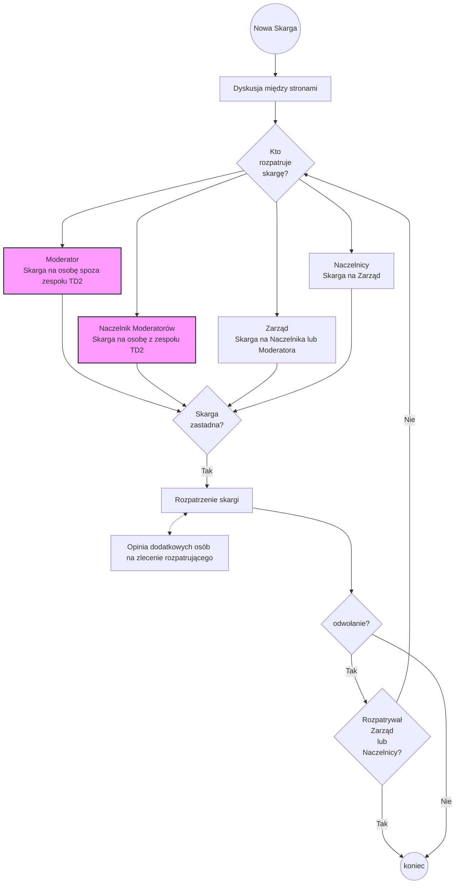

# Reputation flow diagram

```mermaid
graph TD
    ns(("Nowa Skarga"))
    wi["Dyskusja między stronami"]
    mod["Moderator<br>Skarga na osobę spoza zespołu TD2"]
    nmod["Naczelnik Moderatorów<br>Skarga na osobę z zespołu TD2"]
    zarzad["Zarząd<br>Skarga na Naczelnika lub Moderatora"]
    nacz["Naczelnicy<br>Skarga na Zarząd"]
    who{"Kto<br>rozpatruje<br>skargę?"}
    zas{"Skarga<br>zastadna?"}
    orz1["Rozpatrzenie skargi"]
    pom1["Opinia dodatkowych osób na zlecenie rozpatrującego"]
    odw1{"odwołanie?"}
    odw2{"Rozpatrywał<br>Zarząd<br>lub<br>Naczelnicy?"}
    koniec(("koniec"))


    ns --> wi
    wi --> who
    who ---> mod
    who --> nmod
    who --> zarzad
    who ---> nacz
    mod ---> zas
    nmod --> zas
    zarzad --> zas
    nacz ---> zas
    zas -- Tak --> orz1
    orz1 <-.-> pom1
    orz1 ---> odw1
    odw1 -- Tak --> odw2
    odw2 -- Nie --> who
    odw2 -- Tak ---> koniec
    odw1 -- Nie ---> koniec

    %% Definiowanie klasy CSS
    classDef centeredText fill:#f9f,stroke:#333,stroke-width:2px,text-align:center,dominant-baseline:middle,text-anchor:middle;
    %% Przypisywanie klasy do nodów
    class mod,nmod centeredText;
```