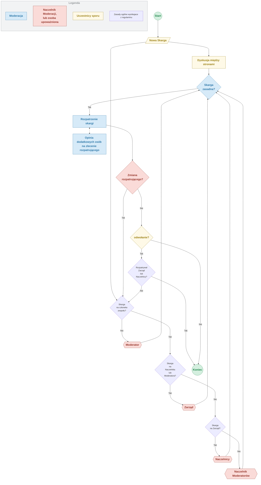

# Reputation flow diagram

```mermaid
graph TD
    start(("Start"))
    ns@{ shape: lean-r, label: "Nowa Skarga"}
    wi["Dyskusja między stronami"]
    target1{"Skarga<br>na członeka<br>zespołu?"}
    target2{"Skarga<br>na<br>Naczelnika<br>lub<br>Moderatora?"}
    target3{"Skarga<br>na Zarząd?"}
    mod{{"Moderator"}}
    nmod{{"Naczelnik Moderatorów"}}
    zarzad{{"Zarząd"}}
    nacz{{"Naczelnicy"}}
    zas{"Skarga<br>zasadna?"}
    orz1["Rozpatrzenie skargi"]
    pom1["Opinia dodatkowych osób na zlecenie rozpatrującego"]
    odw1{"odwołanie?"}
    odw2{"Rozpatrywał<br>Zarząd<br>lub<br>Naczelnicy?"}
    koniec(("Koniec"))
    zmr{"Zmiana<br>rozpatrującego?"}
    subgraph Legenda
        direction TB
        legendBlue["Moderacja"]
        legendRed["Naczelnik Moderacji,<br>lub osoba upoważniona"]
        legendYellow["Uczestnicy sporu"]
        legendDefault["Zasady ogólne wynikajace z regulaminu"]
        end

    start:::green-->ns:::user
    ns ---> wi:::user
    ns --> target1
    wi --> zas:::mod
    mod --> zas
    nmod --> zas
    zarzad --> zas
    nacz --> zas
    zas -- Tak ---> orz1:::mod
    orz1 <-.-> pom1:::mod
    orz1 ---> zmr:::adm
    zmr -- Tak --> target1
    zmr -- Nie -----> odw1:::user
    target1 -- Nie ---> mod:::adm
    target1 -- Tak ----> target2
    target2 -- Nie ----> target3
    target2 -- Tak ---> zarzad:::adm
    target3 -- Nie ----> nmod:::adm
    target3 -- Tak ---> nacz:::adm

    odw1 -- Tak --> odw2
    odw2 -- Nie --> target1
    odw2 -- Tak -----> koniec:::green
    odw1 -- Nie -----> koniec

    classDef green fill:#d4efdf,color:#1e8449,stroke:#1e8449,font-weight:bold,font-size:16pt;
    classDef gray fill:#f2f3f4,color:#909497,stroke:#909497,font-weight:bold,font-size:16pt;
    classDef user fill:#fef9e7,color:#9a7d0a,stroke:#9a7d0a,font-weight:bold,font-size:16pt;
    classDef mod fill:#d6eaf8,color:#2874a6,stroke:#2874a6,font-weight:bold,font-size:16pt;
    classDef adm fill:#fadbd8,color:#943126,stroke:#943126,font-weight:bold,font-size:16pt;

    class legendYellow user
    class legendBlue mod
    class legendRed adm
    class Legenda gray
```