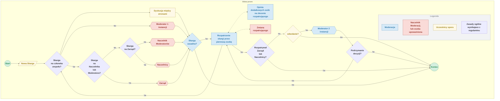

# Reputation flow diagram

```mermaid
graph TD
    subgraph Główny proces
        subgraph Legenda
            direction TB
            legendBlue["Moderacja"]
            legendRed["Naczelnik Moderacji,<br>lub osoba upoważniona"]
            legendYellow["Uczestnicy sporu"]
            legendDefault["Zasady ogólne wynikajace z regulaminu"]
            end
        start(("Start"))
        nowa@{ shape: lean-r, label: "Nowa Skarga"}
        target1{"Skarga<br>na członeka<br>zespołu?"}
        target2{"Skarga<br>na<br>Naczelnika<br>lub<br>Moderatora?"}
        target3{"Skarga<br>na Zarząd?"}
        mod{{"Moderator 1 instancji"}}
        nmod{{"Naczelnik Moderatorów"}}
        zarzad{{"Zarząd"}}
        nacz{{"Naczelnicy"}}
        dyskusja["Dyskusja między stronami"]
        zas{"Skarga<br>zasadna?"}
        orz1["Rozpatrzenie skargi przez pierwszą osobę"]
        orz2{"Podrzymanie<br>decyzji?"}
        pom1["Opinia dodatkowych osób na zlecenie rozpatrującego"]
        odw1{"odwołanie?"}
        odw2{"Rozpatrywał<br>Zarząd<br>lub<br>Naczelnicy?"}
        zmr["Zmiana<br>rozpatrującego"]
        2mod{{"Moderator 2 instancji"}}
        koniec(("Koniec"))
        end

    start:::green-->nowa:::user
    nowa --> target1
    target1 --> dyskusja:::user
    dyskusja --> zas:::mod
    mod --> zas
    nmod --> zas
    zarzad --> zas
    nacz --> zas
    zas -- Tak --> orz1:::mod
    zas -- Nie --> koniec
    orz1 <-.-> pom1:::mod
    orz1 <-.-> zmr:::adm
    orz1 -- Tak --> target1:::default
    orz1 -- Nie --> odw2:::default
    target1 -- Nie --> mod:::adm
    target1 -- Tak --> target2:::default
    target2 -- Nie --> target3:::default
    target2 -- Tak --> zarzad:::adm
    target3 -- Nie --> nmod:::adm
    target3 -- Tak --> nacz:::adm

    odw1 -- Tak --> 2mod:::mod
    2mod --> orz2
    orz2 -- Tak --> koniec
    orz2 -- Nie --> orz1
    odw2 -- Nie --> odw1:::user
    odw2 -- Tak --> koniec:::green
    odw1 -- Nie --> koniec

    classDef green fill:#d4efdf,color:#1e8449,stroke:#1e8449,font-weight:bold,font-size:16pt;
    classDef gray fill:#f2f3f4,color:#909497,stroke:#909497,font-weight:bold,font-size:16pt;
    classDef user fill:#fef9e7,color:#9a7d0a,stroke:#9a7d0a,font-weight:bold,font-size:16pt;
    classDef mod fill:#d6eaf8,color:#2874a6,stroke:#2874a6,font-weight:bold,font-size:16pt;
    classDef adm fill:#fadbd8,color:#943126,stroke:#943126,font-weight:bold,font-size:16pt;
    classDef default font-weight:bold,font-size:16pt;

    class legendYellow user
    class legendBlue mod
    class legendRed adm
    class Legenda gray
```